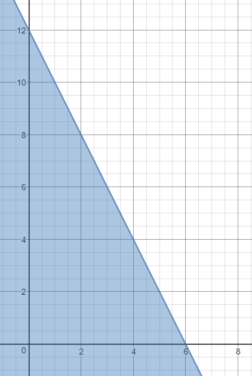
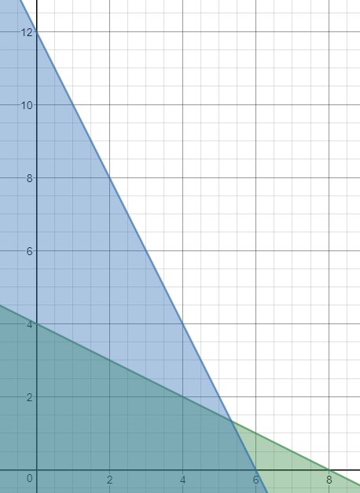
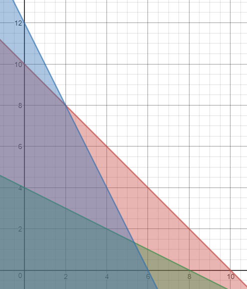
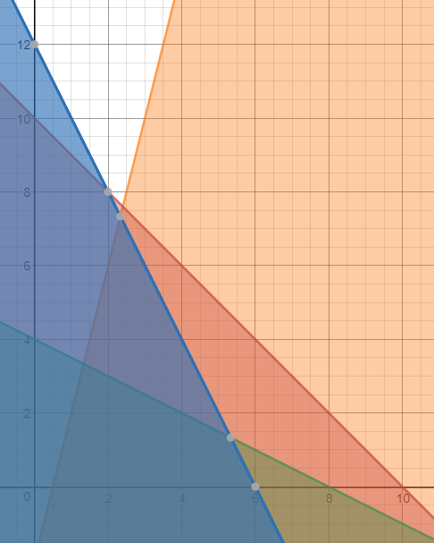
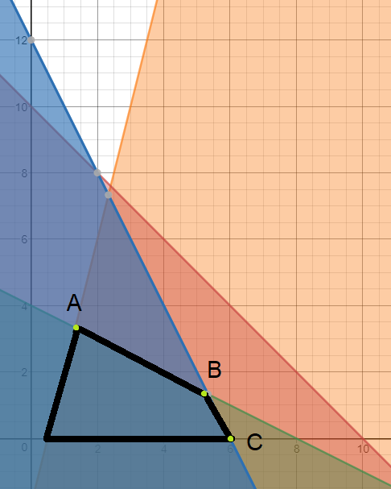

In this post, we’ll see how to solve a Linear Programming problem using the graphical method.

The graphical method consists of two main phases:

Finding the solution space (the space where we have all the valid solutions) by drawing each constraint.
Finding the optimal solution – a solution that will give us the maximum value for the objective function.
Let’s solve the following problem:

Maximize Z = 18x + 24y
 
s.t.
 
1) 2x + y <= 12
2) 3x + 6y <= 24
3) x + y <= 10
4) 2x - 0.5y >= 1
 
x >= 0, y >= 0
First, we’ll find the solution space. We’ll do so by drawing the graph of each one of the constraints.

First constraint: 2x + y <= 12

By setting the point (0, 0) we can easily draw the graph of the constraint

x = 0 -> y = 12
y = 0 -> x = 6

Now let’s draw the graph

The reason only the left side is highlighted is due to 0 <= 12

We’ll do the same thing for the next constraints.

Let’s set (0, 0) for 3x + 6y <= 24

x = 0 -> y = 4
y = 0 -> x = 8

Let’s test if it’s the right area or the left one. According to 0 <= 24 it’s the area left to the equation.

Moving to the third constraint.

Setting (0, 0) for x + y <= 10 we’ll get

x = 0 -> y = 10
y = 0 -> x = 10
You probably already know at this point that it’s the left to the graph area.

The last one would be 2x - 0.5y >= 1. Setting (0, 0) we’ll get

x = 0 -> y = -2
y = 0 -> x = 0.5
This time 0 >= 1 is wrong, so it’s the right to the equation area.

And the last constraints are x >= 0 and y >= 0 which means the solution is in the first quadrant.

We now have our solution space (the common space of all the constraints) and three possible points for the optimal solution.

We’ll now move to the next phase where we’ll decide which of the points is the optimal solution.

To do so, we’ll have to calculate the slope of the objective function

18 / 24 = 0.75
Now, in order to determine the optimal solution, we need to calculate the slope of each of the constraints. If the slope of the objective function is smaller than the slope of the second constraint then,  the optimal solution is in point A. If the slope of the objective function is bigger than the slope of the second constraint but smaller than the slope of the first constraint then, the solution is in point B. Finally, if the slope of the objective function is bigger than the slope of the first constraint then, the solution is at point C.

Let’s calculate now the slopes of the first and second constraints.

first constraint:  2/1 = 2
second constraint: 3/6 = 1/2
1
2
first constraint:  2/1 = 2
second constraint: 3/6 = 1/2
In our case, the slope of the objective function is bigger than the second constraint but smaller compared to the first one ( 1/2 < 0.75 < 2) so the optimal solution is in point B.

To find the value of the solution we’ll calculate the point of intersection between the first constraint and the second one.

2x + y = 12
3x + 6y = 24  / :3

2x + y = 12
x + 2y = 8   / *2

2x + y = 12
2x + 4y = 16
-------------
3y = 4
y = 1.333
x = 5.333

Z = 18x + 24y
Z = 18*5.333 + 24* 1.333 = 128

We found our optimal solution! –  Z = 128. Amazing 😀

Shadow price

A shadow price of a specific constraint defines how much the value of the objective function will change when increasing the value of the constraint (the right-hand side) by one unit.

Let’s calculate the shadow price of each of the constraints from the example. We’ll start with the first constraint

2Δx + Δy = 1
3Δx + 6Δy = 0 / :6
 
2Δx+ Δy = 1
0.5Δx + Δy = 0
---------------
1.5Δx = 1
Δx = 0.6667
Δy = -0.3333
 
Z = 18x + 24y
ΔZ = 18.*0.6667 + 24*(-0.3333) = 4

The shadow price of the first constraint is 4. Meaning that changing by unit the first constraint will increase the objective function value by 4.

Let’s do the same for the second constraint

2Δx + Δy = 0  / *6
3Δx + 6Δy = 1
 
12Δx+ 6Δy = 0
3Δx + 6Δy = 1
---------------
9Δx = -1
Δx = -1/9
Δy = 2/9
 
Z = 18x + 24y
ΔZ = 18.*(-1/9) + 24*(2/9) = 3.3333
3.3333 is the shadow price of the second constraint.

The shadow price of the third constraint is 0. Same goes for the fourth constraint. The reason for this is they are not part of the optimal solution. Only the first and second constraints are.

The first and the and the second constraints are also called “active constraints”.

Objective Function Bounds

By finding the bounds of an objective function, we can define the range of values which can be given to the coefficients of the objective function without changing the optimal solution.

We’ll write the objective function in the following way:Z = cx + 24y .The slope of the function is c/24

As long as the slope will remain bigger than 3/6 and smaller than 2, the optimal solution will remain point B.

3/6 < c/24  ->  12 <= c
c/24 <= 2   ->  c <= 48
As you can see the upper bound is 48 while lower bound is 12.

If the coefficient of variable x in the objective function is smaller than 12, it means the slope of the objective function will be smaller than the slope of the second constraint and the optimal  solution will be in point A instead of B. This also means that the first constraint will cease to be an active constraint and the fourth constraint will turn into an active constraint.

Now we’ll write the objective function this way: Z = 18x + cy.  The slope of the function is now 18/c.

As long as the slope will remain bigger than 3/6 and smaller than 2, the optimal solution will remain point B.

3/6 < 18/c  ->  c <= 36
18/c <= 2   ->  9 <= c
Upper bound is 36 while lower bound is 9.

If the coefficient of variable y in the objective function is smaller than 9, it means the slope of the objective function will be smaller than the slope of the first constraint and the optimal solution will be in point C instead of B. This also means that the second constraint will cease to be an active constraint.

If the coefficient of variable y in the objective function is bigger than 36, it means the slope of the objective function will be smaller than the slope of the second constraint and the optimal solution will be in point A instead of B. This also means that the first and the fourth constraints will cease to be active constraints.
